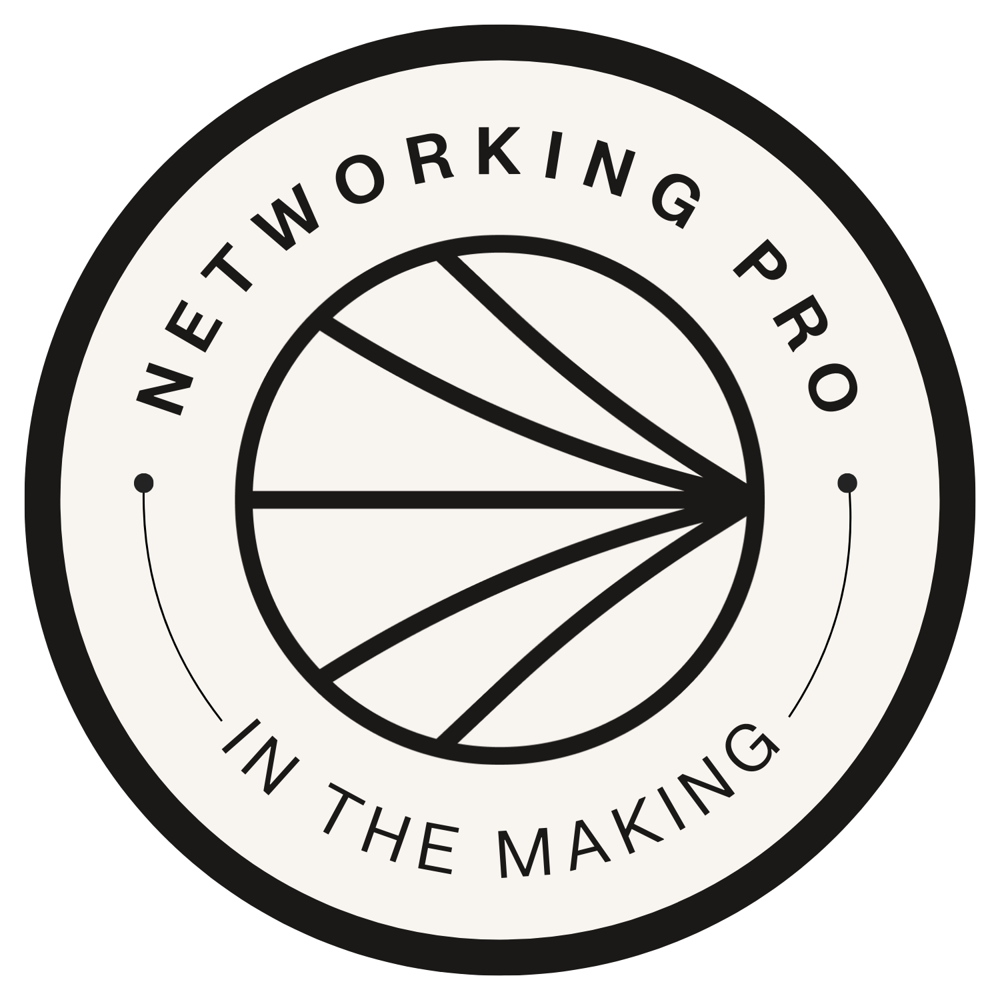

  

  
  
  
  
  

<h1 align="center">AWS Networking Projects Portfolio</h1>

  A structured collection of hands-on AWS networking projects demonstrating real-world cloud networking,
  security, monitoring, and private service access.

---

## Overview

This repository serves as a master index for my AWS Networking projects completed through the **NextWork** learning series.  
Each project builds on the previous one, forming a complete cloud networking foundation aligned with cloud engineering and cloud security roles.

The portfolio focuses on **design, implementation, testing, troubleshooting, and monitoring** of AWS network infrastructure.

---

## Project Index

### 1. Cloud Networking Foundations
- **Get Hands-on with Cloud Networking (AWS VPC Intro)**  
  https://github.com/shanebrown848/Get-Hands-on-with-Cloud-Networking-AWS-VPC-Intro

### 2. Virtual Private Cloud (VPC)
- **Build a Virtual Private Cloud (AWS VPC)**  
  https://github.com/shanebrown848/Build-a-Virtual-Private-Cloud-AWS-VPC

### 3. VPC Traffic Flow & Security
- **VPC Traffic Flow and Security**  
  https://github.com/shanebrown848/VPC-Traffic-Flow-and-Security

### 4. Private Subnets
- **Creating a Private Subnet**  
  https://github.com/shanebrown848/Creating-a-Private-Subnet

### 5. Launching Compute in a VPC
- **Launching VPC Resources**  
  https://github.com/shanebrown848/Launching-VPC-Resources

### 6. VPC Connectivity Testing
- **Testing VPC Connectivity**  
  https://github.com/shanebrown848/Testing-VPC-Connectivity

### 7. VPC Peering
- **VPC Peering**  
  https://github.com/shanebrown848/VPC-Peering

### 8. VPC Monitoring
- **VPC Monitoring with Flow Logs**  
  https://github.com/shanebrown848/VPC-Monitoring-with-Flow-Logs

### 9. Accessing S3 from a VPC
- **Access S3 from a VPC**  
  https://github.com/shanebrown848/Access-S3-from-a-VPC

### 10. VPC Endpoints
- **VPC Endpoints**  
  https://github.com/shanebrown848/VPC-Endpoints

---

## Skills Demonstrated

- AWS VPC architecture and subnet design  
- Routing, traffic flow, and connectivity analysis  
- Security groups and network ACLs  
- Private networking and VPC peering  
- Connectivity testing and troubleshooting  
- Network monitoring with VPC Flow Logs  
- Secure service access using VPC endpoints  
- IAM, policies, and least-privilege access  

---

## Why This Portfolio Matters

Cloud networking is foundational to cloud engineering, DevOps, and cloud security roles.  
These projects demonstrate not just configuration, but **understanding, validation, and troubleshooting** of secure cloud networks.

This portfolio reflects real AWS networking scenarios and production-style best practices.

---

## Documentation

Each project repository includes:
- A dedicated `README.md`
- A `documentation.md` file with step-by-step notes, commands, diagrams, and reflections

---

## Credits

Built as part of the **NextWork** AWS Networking learning series.
